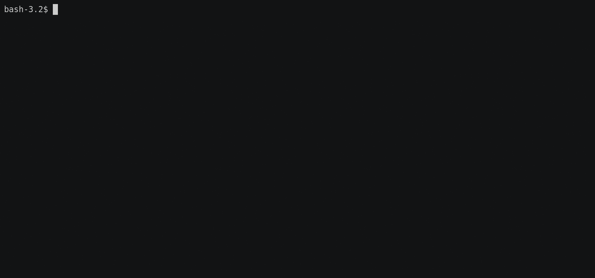

Builds a container image that outputs `Hello World` when run.

This repo is based on the `helloworld` example from the https://github.com/GoogleContainerTools/jib repo to demonstrate a Maven based setup with labels

To build the image:

1. In `pom.xml` replace `image-registry` property with your registry (and account if applicable) or use a `-D` parameter as shown below

1. If needed, add registry credentials via instructions at https://github.com/GoogleContainerTools/jib/tree/master/jib-maven-plugin#authentication-methods

1. Run `mvn package` with an optional `-D myimage.registry.com:5000` as needed if you didn't update that property in the `pom.xml` above.

